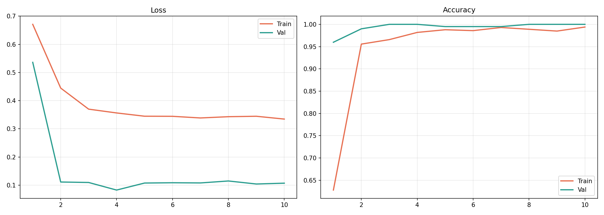
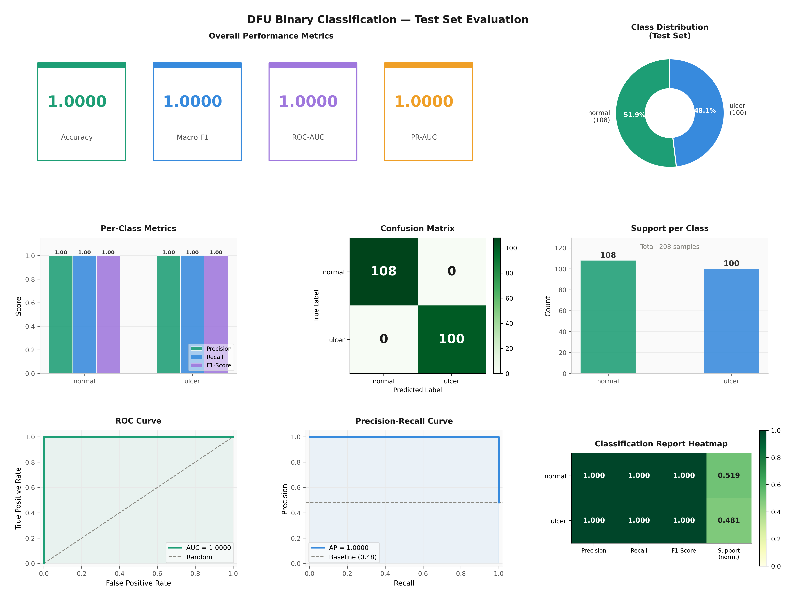
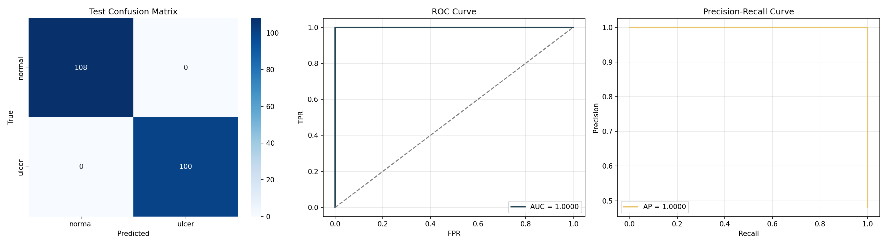
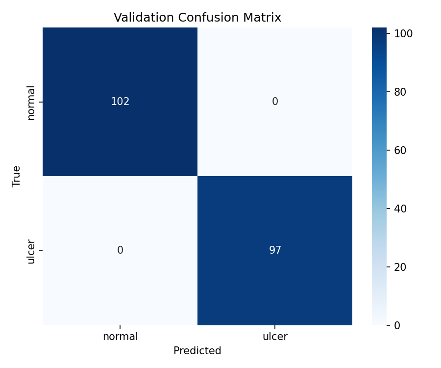

# 🦶 PodoScan — Diabetic Foot Ulcer Detection & Severity Analysis


> An end-to-end clinical AI system for automated detection and severity grading of Diabetic Foot Ulcers (DFU) from wound images, powered by deep learning and a Vision-Language Model assistant.

---

## Overview

Diabetic Foot Ulcers (DFU) affect approximately 15% of all diabetic patients and are a leading cause of non-traumatic lower limb amputations worldwide. Early detection and accurate severity grading are critical for effective clinical intervention.

**PodoScan** automates this process using a fine-tuned deep learning model combined with unsupervised image feature extraction — no severity labels required. An integrated LLM-powered clinical assistant answers medical questions about each wound in real time.

### What it does

| Step | Process | Output |
|---|---|---|
| 1 | Upload wound image | — |
| 2 | Deep learning detection | Ulcer / Non-Ulcer + confidence % |
| 3 | HSV feature extraction | Redness, darkness, slough, area, texture scores |
| 4 | Weighted severity scoring | Mild / Moderate / Severe grade |
| 5 | LLM clinical assistant | Natural language explanation + Q&A |
| 6 | Database storage | All results saved to MySQL automatically |

### Key Features

- 🔍 **Binary Classification** — Ulcer vs Non-Ulcer with confidence score
- 📊 **Severity Grading** — Automated Mild / Moderate / Severe assessment
- 🎨 **Feature Extraction** — 5 clinical wound features extracted from image
- 🤖 **Clinical AI Chat** — Streaming LLaMA 3.3 70B assistant with wound context
- 📈 **Analytics Dashboard** — Real-time stats, history, severity distribution
- 💾 **Auto Storage** — Every prediction saved directly to MySQL
- 📱 **Responsive UI** — Works on desktop and mobile

---

## Model

The detection model is built on **EfficientNetV2-S** pretrained on ImageNet-1K with a custom 2-class head:
```
EfficientNetV2-S Backbone (pretrained)
        ↓
Dropout(0.4) → Linear(in → 512) → SiLU → Dropout(0.3) → Linear(512 → 2)
```

**Training highlights:**
- Loss — Label Smoothing Cross-Entropy + Class Weights
- Optimiser — AdamW (lr=3e-4, weight_decay=1e-4)
- Schedule — Linear Warmup (5 epochs) + Cosine Annealing
- Augmentation — 15+ Albumentations transforms
- Mixed Precision — PyTorch AMP
- Early Stopping — patience=12
- Inference — Test-Time Augmentation × 5

**Dataset:**

| Split | Images |
|---|---|
| Train | 1,016 |
| Validation | 208 |
| Test | 199 |
| **Total** | **1,423** |

---

## Severity Analysis

Since no severity labels existed, an unsupervised feature-based approach grades detected ulcers:

| Feature | Weight | Clinical meaning |
|---|---|---|
| Darkness | 30% | Necrosis / dead tissue |
| Area Ratio | 25% | Wound size |
| Redness | 20% | Active inflammation |
| Yellow/Slough | 15% | Slough or pus presence |
| Texture | 10% | Surface irregularity |

| Grade | Score Range | Description |
|---|---|---|
| 🟢 Mild | 0.00 – 0.35 | Superficial wound, minimal tissue involvement |
| 🟡 Moderate | 0.35 – 0.60 | Deeper wound with signs of inflammation or slough |
| 🔴 Severe | 0.60 – 1.00 | Significant necrosis, large wound area, or deep tissue damage |

---

## Tech Stack

| Layer | Technology |
|---|---|
| Model | EfficientNetV2-S (PyTorch) |
| Augmentation | Albumentations |
| Backend | FastAPI + Uvicorn |
| Frontend | React 18 + Vite |
| Database | MySQL 8.0 |
| Clinical AI | LLaMA 3.3 70B |
| Charts | Recharts |

---

## Evaluation Results

The model was evaluated on the held-out test set of 199 images using TTA × 5.

### Test Set Performance

| Class | Precision | Recall | F1-Score | Support |
|---|---|---|---|---|
| non_ulcer | 1.0000 | 1.0000 | 1.0000 | 108 |
| ulcer | 1.0000 | 1.0000 | 1.0000 | 100 |
| **Macro Avg** | **1.0000** | **1.0000** | **1.0000** | **208** |

| Metric | Score |
|---|---|
| Accuracy | 1.0000 |
| Macro F1 | 1.0000 |
| ROC-AUC | 1.0000 |
| PR-AUC | 1.0000 |

---

### Training Curves



---

### Full Evaluation Dashboard



---

### ROC, PR Curve & Confusion Matrix



---

### Validation Confusion Matrix



---
